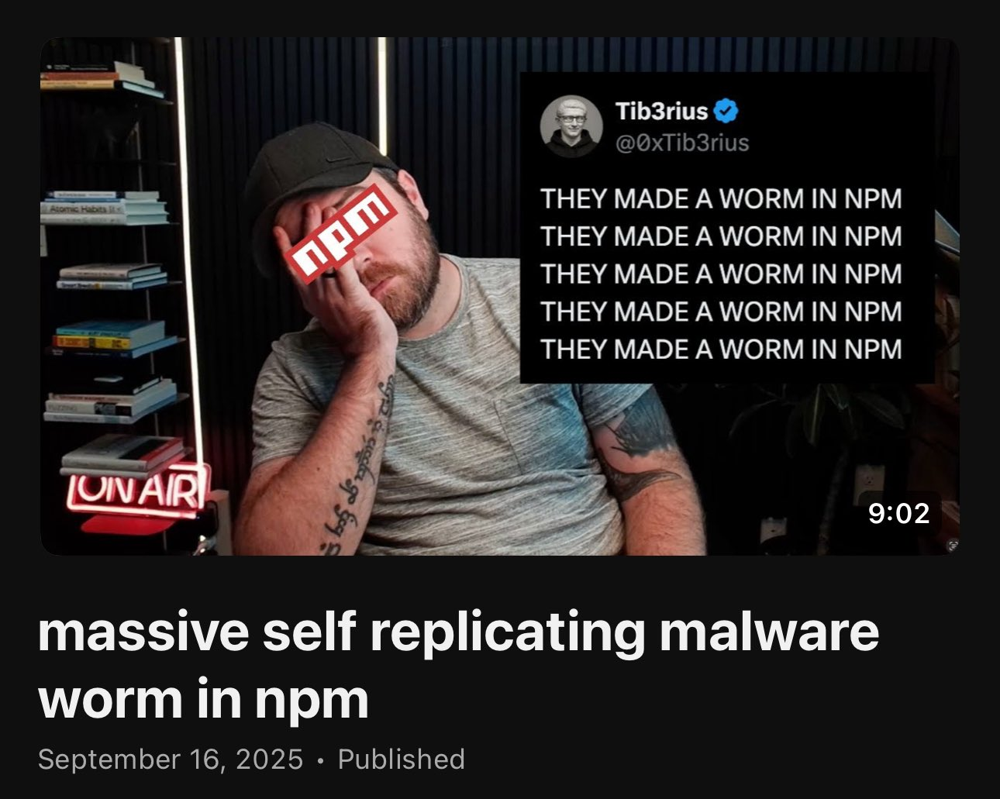
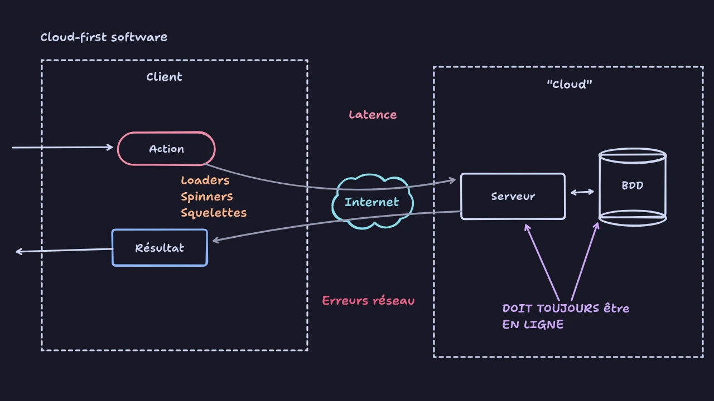
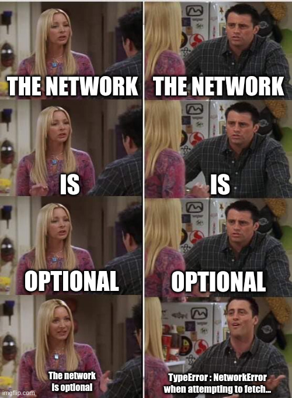
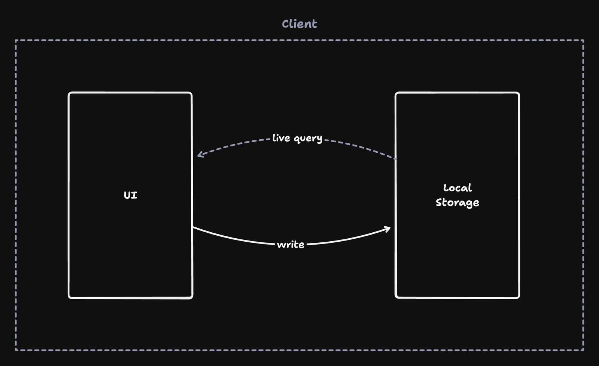
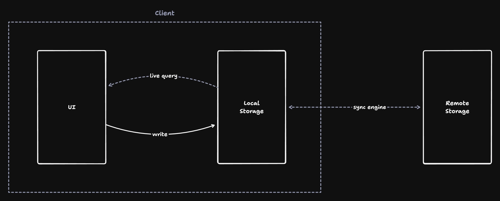
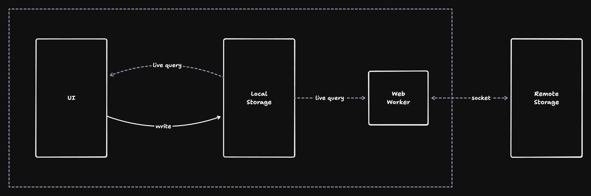
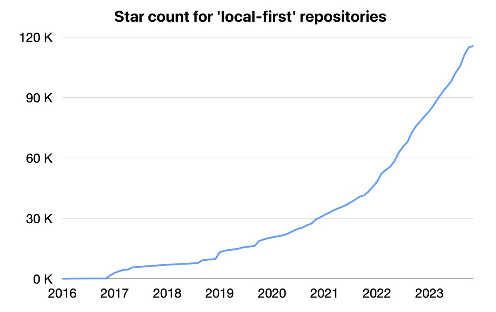
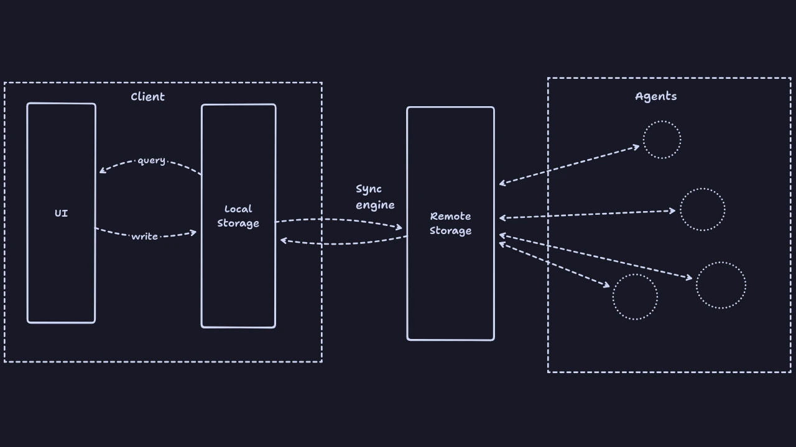

<!-- .slide: data-background-image="images/hollow-knight/city-of-tears.webp" data-background-position="center center" data-background-size="cover" --> 
# Local-first <br/>& <br/>sync-engines : l'architecture du futur ?


<!-- .slide: data-background-image="images/hollow-knight/hollow-knight.webp" data-background-position="center center" data-background-size="cover" --> 
## 1. Notre héros du jour

Notes :
- un développeur web, dans sa zone de confort. (~ 2 minutes)
- en reconversion, découvre le monde


## Front / Back
<div id="classic-architecture"></div>

Notes :
- il arrive sur les projets et on lui dit, tu va faire du front, ou bien tu vas faire du back.
- il fait sa feature, en local, boume, il livre et là : bugs de partout, c'est lent, on peut cliquer plusieurs fois sur un bouton, son appli crashe en cas de réponse 500 du serveur.
- bon bref, trève de story telling.


### Le dev web front aujourd'hui c'est l'enfer

Notes :
- bon... ceci n'est pas un talk pour cracher sur l'écosystème NPM
- ni sur js, ni sur node.js
- on va cracher sur le réseau surtout


### Taille des bundle javascript.


- 📦 ne sera pas addressée dans ce talk.<!-- .element class="fragment"-->
Notes :
- oui, désolé, c'est pas le sujet
- contexte, je vais parler d'APPLICATIONS WEB, pas de sites statiques.
- ça s'applique aussi au mobile


### Architecture... populaire ?
<div id="cloud-first-software"></div>
<!---->

Notes :
- SPA/UI <=> API <=> DB
- prenons une architecture typique client serveur
- on fait ça de base en démarrant un nouveau projet.
- ca a des avantages, mais beaucoup de problèmes.
- une base de données centralisée, un bon gros server spring-boot, du java, de l'angular ou du react en front
- contraintes d'uptime, astreintes, haute disponibilité.


### lenteurs principalement dues au réseau, asynchronicité
```
L1 cache reference                           0.5 ns
Branch mispredict                            5   ns
L2 cache reference                           7   ns                      14x L1 cache
Mutex lock/unlock                           25   ns
Main memory reference                      100   ns                      20x L2 cache, 200x L1 cache
Compress 1K bytes with Zippy             3,000   ns        3 us
Send 1K bytes over 1 Gbps network       10,000   ns       10 us
Read 4K randomly from SSD*             150,000   ns      150 us          ~1GB/sec SSD
Read 1 MB sequentially from memory     250,000   ns      250 us
Round trip within same datacenter      500,000   ns      500 us
Read 1 MB sequentially from SSD*     1,000,000   ns    1,000 us    1 ms  ~1GB/sec SSD, 4X memory
Disk seek                           10,000,000   ns   10,000 us   10 ms  20x datacenter roundtrip
Read 1 MB sequentially from disk    20,000,000   ns   20,000 us   20 ms  80x memory, 20X SSD
Send packet CA->Netherlands->CA    150,000,000   ns  150,000 us  150 ms
```
Source: [Latency numbers every programmer should know](https://gist.github.com/jboner/2841832)


#### Latence
<div id="latency-balls"></div>


#### Latence (source)

<https://planetscale.com/blog/caching>


Notes :
- à garder en tête, ici on est à l'intérieur d'un ordinateur
- en dessous de la milliseconde, si vous avez des appliquations qui mettent plus d'une seconde à démarrer faut se poser des questions
- nos applications web et distribuées d'aujourd'hui elles ont un impondérable: la latence réseau


#### Network Calls
<div id="network-balls"></div>

- Qu'est ce qui est "acceptable" ?

Notes :
- C'est physique, la distance fait qu'on doit gérer ça
- acceptable en terme de tmps de réponse ? je pose la question ?
- à l'heure ou la loi de moore n'en finit plus, mais on ne la voit plus
- des centaines de milliards de petaflop de GPU dans le cloud.


#### Rappel
- 300ms 👀

Notes :
- on percoit la lenteur, la latence à partir d'environ ce temps
- en dessous, on a une "impression" de rapidité
- c'est pas parce qu'on fait des nimations à cette lenteur que vos services sont "autorisés" à prendre autant de temps  !!!


#### Pas tout le monde il a la fibre
- 🚃 Dans les transports<!-- .element class="fragment"-->
- 🛜 Wifi de conférence<!-- .element class="fragment"-->
- 🍻 Au fond de votre bar préféré<!-- .element class="fragment"-->
Notes :
- j'entends souvent : des trucs du genre oui, mais à l'heure de la fibre,
- à l'heure du cloud et du haut débit, c'est pas si grave
- c'est pas grave si notre api principale mets 1,5 secondes à répondre ? QUOI ? je hurle
- 


### What could go wrong ?

```javascript [|4-6|8-20|22-23|26-29|9-11]
import React, { useState, useEffect } from 'react'; 

function DataFetchingExample() {
  const [data, setData] = useState(null);
  const [loading, setLoading] = useState(true);
  const [error, setError] = useState(null);

  useEffect (() => {
    fetch('https://jsonplaceholder.typicode.com/todos')
      // here be dragons ?
      .then(response => response.json())
      .then(data => {
        setData(data);
        setLoading(false);
      })
      .catch(error => {
        setError (error);
        setLoading(false);
      });
  }, []);

  if (loading) return <p>Loading...</p>;
  if (error) return <p>Error: {error.message}</p>;

  return ( 
    <div>
      <h1>Fetched Data</h1>
	  <pre>{JSON. stringify(data, null, 2)}</pre> 
	</div>
  );
}
```

#### EVERYTHING!<!-- .element class="fragment"-->
Notes :
- Qu'est ce qui va pas dans ce code ? en dehors que c'est du react
- // TODO ajouter du code fetch / json


### Synchronisation...
- plusieurs onglets ouvert<!-- .element class="fragment"-->
- ctrl+R / F5 qui cassent tout<!-- .element class="fragment"-->
- state!<!-- .element class="fragment"-->
Notes :
- ça vous est déjà arriver de remplir un champ de formulaire et de le perdre en fermant l'onglet ?
- problèmes de SPA classique


### Gestion d'état
- Plus de session en back (*tousse tousse* REST)
- Guess what... c'est le front qui gère...
- Complexité ++
Notes :


### Complexité du front
- gestion d'erreurs possibles
- asynchronicité / conditions de course
Notes :
- aujourd'hui si on a des SPA, gestion d'état et que le front web est devenu complexe
- c'est à cause de la latence, du réseau à gérer


### There is no cloud
#### it's just someone else's computer


### Data leaks
🏴‍☠️

Notes :
- BDD centralisées.
- Pourtant il y a, du moins il y aurait des solutions
- Du coup est apparu le concept principal dont je veux parler aujourd'hui
- Le "local-first"


<!-- .slide: data-background-image="images/hollow-knight/bench.webp" data-background-position="center center" data-background-size="cover" --> 
## 2. Qu'est-ce qu'on VEUT faire avec le local-first ?
Notes :
- Bon c'est quoi, d'où ça sort ?


### Ink and switch


Essai : [https://www.inkandswitch.com/essay/local-first/](https://www.inkandswitch.com/essay/local-first/)

Notes :
- Le concept n'est pas de moi
- Regroupe quelques concepts sous la même bannière.


### Principes du "local-first"


#### 1. No spinners: work at your fingertips
- 🛞 Pas de spinner<!-- .element class="fragment"--> 
- 💈 Pas barres de progress<!-- .element class="fragment"-->
- 💀 Pas de squelettes<!-- .element class="fragment"-->


#### 2. Your work is not trapped on one device
- 📦 Au delà du local storage<!-- .element class="fragment"-->
- 📱 Mobile<!-- .element class="fragment"-->
- 💻 Portable<!-- .element class="fragment"-->
- 🖥️ Pas portable<!-- .element class="fragment"-->


#### 3. The network is optional
- Le.<!-- .element class="fragment"-->
- Réseau.<!-- .element class="fragment"-->
- Est.<!-- .element class="fragment"-->
- Optionnel.<!-- .element class="fragment"-->
Notes :
- oui, ironiquement, il y a tout ajd pour qu'une app web fonctionne hors ligne
- `navigator.connection`
- service worker: arréter de kernel panic





#### 4. Seamless collaboration with your colleagues
- Si pas de centralisation...<!-- .element class="fragment"-->
- Pas de "409 Conflict" <!-- .element class="fragment"-->
Notes :
- changement de paradigme avec différence d'état
- on considère que tout le monde a tout le temps la même version
- gérer les conflits avec les données des autres plutôt que sous une autorité centrale


#### 5. The long now
> “The Long Now is the recognition that the precise moment you're in grows out of the past and is a seed for the future.”

Notes :
- L'idée, c'est que vous faite du code pour longtemps
- on évite des formats qui périment pas au bout de 3 ans
- serveur / service qui se terminent.


#### 6. Security and privacy by default
- RGPD, anyone ?


#### 7. You retain ultimate ownership and control
- Vous possédéz vos données.
- Vous contrôlez vos données.


### Les idéaux...
- c'est bien d'en avoir.
- Dans la réalité...


### Quels cas d'usages?
- ✅ édition de documents/fichiers (graphes/canvas, dessins, texte, musique)<!-- .element class="fragment"-->
- ✅ données personnelles (notes, chat, calendriers, budget, localisation)<!-- .element class="fragment"-->
- ❌ Back office CRUD de gestion<!-- .element class="fragment"-->
- ✅ Back office CRUD de gestion<!-- .element class="fragment"-->
- ❌ réseau social<!-- .element class="fragment"-->
- ❌ e-commerce<!-- .element class="fragment"-->
- ❌ banque<!-- .element class="fragment"-->

Notes :
- tout ce qui a besoin d'une centralisation / autorité / source of truth
- CRUD de gestion : si pas besoin d'instantanéité
- en vrai


### Résumé
1. No spinners: work at your fingertips
2. Your work is not trapped on one device
3. The network is optional
4. Seamless collaboration with your colleagues
5. The long now<span class="fragment"> (bonus)</span>
6. Security and privacy by default<span class="fragment"> (bonus)</span>
7. You retain ultimate ownership and control<span class="fragment"> (bonus)</span>
Notes :
- pour moi les 4 premiers sont indispensables à une application local-first
- le reste c'est du bonus
- donc, comment on va implémenter ca ?


<!-- .slide: data-background-image="images/hollow-knight/hornet.jpeg" data-background-position="center center" data-background-size="cover" --> 
## 3. Qu'est ce que ça veut dire, et en quoi c'est différent ?
Notes :
- local-first: comment on fait ?
- On a vu ce que c'était maintenant, comment on implémente ?


### Un petit schéma
<div id="local-first-software"></div>
Notes :
- l'idée c'est que tout tourne en local d'abord.
- que votre logique métier de gestion / transformation de données soit dans le front
- moins de coûts d'hébérgement cloud, votre back peut être down.


#### Base de données locale
- IndexedDB
- SQLite<!-- .element class="fragment"-->
- PGLite<!-- .element class="fragment"-->
- Turso 🦀<!-- .element class="fragment"-->
- DuckDB 🦆<!-- .element class="fragment"-->
- TinyBase<!-- .element class="fragment"-->
- etc...<!-- .element class="fragment"-->
Notes :
- BDD qui tourne dans votre navigateur
- en WASM pour les deux derniers
- y'en asurement plein d'autres, j'ai pas la science infuse.


#### But why?


Notes :
- vitesse
- offline
- privacy
- simplicité


#### Live queries


- IndexedDB (DexieJs with liveQuery)
- Postgres (PgLite's live queries)
- SQLite (using WASM and something like wa-sqlite)


#### Live queries (exemple dexie)
```typescript [|6-8|14-19]
import { useLiveQuery } from "dexie-react-hooks";
import { db } from "./db";

export function FriendList() {
  // Automatically re-renders when data changes ⚡️
  const friends = useLiveQuery(() =>
    db.friends.where("age").between(50, 75).toArray()
  );

  return (
    <>
      <h2>Friends</h2>
      <ul>
        {friends?.map((friend) => (
          <li key={friend.id}>
            {friend.name}, {friend.age}
          </li>
        ))}
      </ul>
    </>
  );
}
```
Notes :
- mises à jour automatique de la vue en fonction de la DB
- bon c'est cool, mais si j'ai des données locales
- ce qu'on va vouloir aujourd'hui c'est synchronizer, collaborer autour de ces données.
- pour ça y'a plein de solutions.


#### Sync Databases / Real Time Databases
- Supabase
- Firebase
- InstantDB
- PouchDB + CouchDB + RxDB
- Triplit
- Fireproof
- Livestore
- etc...
Notes :
- ou service paas/saas (mélange tout, temps réel)
- surtout ca suffit pas d'avoir une base de données locale (autant faire du client lourd)
- on veut quelle se synchronize toute seule entre les clients
- c'est là qu'on va avoir besoin d'un moteur de synchro


#### Sync engine, introduction

Notes :
- synchronize les données de tous les clients tout en leur permettant d'écrire localement
- chaque client ne s'occupe que de ses données, souvent dans un périmètre restreint
- le moteur s'occupe de s'assurer que tout est tout le temps à jour.
- tourne en tâche de fond


#### Service Worker
- ⚙️ Tourne en tâche de fond
- 🔄 Push / Pull
- 🔌 WebSocket

Notes :
- thread local on va dire, évite de bloquer le rendu principal
- permets d'intercepter des requêtes http d'assets et
- les pré-charger, les mettres en cache.
- et surtout, faire tourner en tâche de fond notre synchronisation de base.
- la vous voyez service worker, les sachants viendront me dire, mais c'est une PWA en fait


####  Sync + websockets



#### et les PWA alors ?
- c'est pas un pré-requis, mais un peu quand même.

<https://whatpwacando.today/>


Notes :
- les deux supporte un mode offline
- pas indispensable, mais très pratique
- vous pouvez faire du local-first sans être une PWA et inversement.
- mode connecté / déconnecté
- notifications natives et autres accès au device goodies.
- on reste sur des appels api en cache


<!-- .slide: data-background-image="images/hollow-knight/rest.jpeg" data-background-position="center center" data-background-size="cover" --> 
## 4. Notre héros galère, mais va s'adapter

Notes :
- bref on a aborder le sujet 1 du local-first, et j'en viens donc au deuxième sujet, le moteur de synchronisation
- parce que c'est cool d'avoir nos données locale, mais sinon autrement faire du client lourd plutôt que webapp.


### sync-engine : qu'est-ce que c'est ?
- 🧩 la pièce manquante à notre puzzle<!-- .element class="fragment"-->
- 🔄 Synchronise IHM & BDD client comme serveur<!-- .element class="fragment"-->
- 🧙 AutoMagic!<!-- .element class="fragment"-->
Notes :
- ou moteur de synchronisation dans la langue de molière 
- automagique dans le bon sens, ca fait le taf pour vous, plus besoin d'y penser.
- parce qu'on veut que chaque utilisateur ait ses données, mais souvent re-partager aux autres.


### Qui utilise ça déjà ?
- Discord
- Slack
- Notion
- Figma
- Linear
- Google Docs
Notes :
- liste non exhaustive
- sous une forme ou une autres ces applis là utilise la synchro


### Un moteur de synchronisation
- si vous faites du dev, vous en utilisez un tous les jours déjà.
Notes :
- les devs, vous en utilisez un tous les jours.


### Git
<div id="git-graph"></div>
Notes :
- considérons que la branche principal c'est notre état serveur, ou notre état partagé
- la branche feature ca va être l'état des données d'un client déconnecté 
- à un moment il va falloir fusionner.


### Problème: consistence des données.

Notes :
- avec git, c'est à vous de résoudre les conflits potentiels
- git a sa structure de données qui stocke les changements


### Comment résoudre les conflits ?
```typescript
// TODO implement the conflictHandler() method
```
Notes :
- pour le coup c'est un vrai todo, tiré d'une lib que je ne citerais pas.
- en mode certaines solutions vous demande d'implémenter ça : démerdez vous.
- la plupart des moteurs utilisent et vous impose d'utiliser des CRDT


### CRDT 
- __C__onflit-free 
- __R__eplicated 
- __D__ata
- __T__ypes
Notes :
- au coeur de ces moteurs de synchro, il y a la notion primordiale
- l'idée c'est qu'au niveau du modèle de donnée, la résolution de conflits va être automatique


### CRDT: propriétés
- mise à jour concurrente sans coordination
- alogrithme de résolution de conflits automatique
- cohérence éventuelle
Notes :
- sans coord avec une autorité centrale
- algorithme propre au type de donnée
- il y a plusieurs librairies en JS qui permettent d'implémenter un CRDT, je vais juste en présenter une.


### Example de CRDT avec Yjs

```typescript[|1|3-8|10-14|16-18|20-21]
import * as Y from 'yjs'

// Yjs documents are collections of
// shared objects that sync automatically.
const ydoc = new Y.Doc()
// Define a shared Y.Map instance
const ymap = ydoc.getMap()
ymap.set('keyA', 'valueA')

// Create another Yjs document (simulating a remote user)
// and create some conflicting changes
const ydocRemote = new Y.Doc()
const ymapRemote = ydocRemote.getMap()
ymapRemote.set('keyB', 'valueB')

// Merge changes from remote
const update = Y.encodeStateAsUpdate(ydocRemote)
Y.applyUpdate(ydoc, update)

// Observe that the changes have merged
console.log(ymap.toJSON()) // => { keyA: 'valueA', keyB: 'valueB' }
```


### data types (automerge)
Composite types
- Maps
- List
- Text

Scalar (non-composite) types:
- IEEE 754 64 bit floating point numbers
- Unsigned integers
- Signed integers
- Booleans
- Strings
- Timestamps
- Counters
- Byte arrays
Notes :
- souvent vous allez passer dans le CRDT des types de données custom
- ca va permettre au CRDT de gérer lui même la résolution conflit finement


### Sérialisation

- déclarer vos types avec une API.
- validation au runtime
- sérialisation (UINT8Array)

Notes :
- le CRDT va souvent s'occuper ausssi de sérialisation
- certains de valider au runtime le type
- avantages taille réduite.


### Bref,

Notes :
- la combinaison de tout ça permet aux moteur de synchronisation
- de gérer la synchronisation en temps réel de vos données.
- en ligne comme hors ligne


### Offline mode
- stale mode
Notes :
- en gros le moteur gérer un état de vos données, synchro /stale 
- 


<!-- .slide: data-background-image="images/hollow-knight/bench-crooked.jpeg" data-background-position="center center" data-background-size="cover" --> 
## 5. Les péripéties
Notes :
Notre héros rencontre des péripéties, différentes implémentations, comparatifs de solutions existantes pour arriver à notre but.  ( ~ 10 minutes )
- J'ai essayé de pas être trop spécifique à une seule lib dans ce talk, parce qu'en vrai il y a du choix


### Bases de données

- indexedDB + pouchdb
- rxdb + couchdb + pouchdb
- electric sql
- fireproof
- orbitDB 
- postgresql + sync engine devant


### conflict free replicated data-types (CRDT).
- Yjs
- automerge
- Loro


### Sync Engines
- zero
- replicache 
- electricSQL
- Livestore
- Powersync
- Evolu
- Ditto
- Convex
- etc...
Notes :
- J'ai pas tout testé, voir encore rien du tout, juste zero me plait


#### Zero


[https://zero.rocicorp.dev/](https://zero.rocicorp.dev/)

Notes :
- // TODO qrcode


#### Show us the code!
```typescript [|5-13|15-20|27-31]
function Playlist({id}: {id: string}) {
  // This usually resolves *instantly*, and updates reactively
  // as server data changes. Just wire it directly to your UI –
  // no HTTP APIs, no state management no realtime goop.
  const [playlist] = useQuery(
    zero.query.playlist
      .related('tracks', track => track
        .related('album')
        .related('artist')
        .orderBy('playcount', 'asc'))
      .where('id', id)
      .one()
  );

  const onStar = (id: string, starred: boolean) => {
    zero.mutate.track.update({
      id,
      starred,
    });
  }

  if (!playlist) return null;

  return (
    <>
      <div>{playlist.name}</div>
      <div>
        {playlist.tracks.map(track => (
          <TrackRow key={track.id} track={track} onStar={onStar}/>
        ))}
      </div>
    </>
  );
}
```
Notes :
- c'est tiré de la doc officielle
- on est sur du React, vous avez un hook
- méthodes mutate / query


### Apparté sur Zero
- encore en alpha
- pas complètement "local-first" pour l'instant
Notes :
- je préfères pas le recommander, mais
- la base est là


### Query / Mutation
| ?  | HTTP |
| - | - |
| query  | GET  |
| mutate  | POST  |
|   | PUT  |
|   | PATCH  |
|   | DELETE  |
|   | OPTIONS |
|   | TRACE |
|   | CONNECT |
|   | HEAD |

Notes :
- Si vous avez fait du graphql ca doit vous parler,
- Bien plus simple à appréhender
- de toutes facons est-ce que vous utilisiez vraiment autre chose que GET et POST
- y'a pas que Zero qui offre ce genre d'api, la plupart des stores / sync engines s'en approche


<!-- .slide: data-background-image="images/hollow-knight/mantis-lords.webp" data-background-position="center center" data-background-size="cover" -->
## 6. La souffrance du changement
Notes :
- , notre héros galère pour atteindre son but  ( ~ 5 minutes )


### Changement de paradigme


### Changement de paradigme (2)
<!-- <div id="data-fetching"></div>-->

<!--<div id="data-sync"></div>-->


### MPA => SPA => PWA => SPA+SSR => local-first
Notes :
- déjà un paradigme en ce moment
- ce sera pas le premier ni le dernier changement paradigme dans notre métier


### Intérêts vs coûts d'implémentation.
Notes :
- faut pas se leurre, la plupart de nos clients vont pas en voir l'intérêt
- on est plus dans une course au cloud ajd
- par contre côté utilisateurs, c'est ce qu'on veut.


### et la sécurité dans tout ça ?
🛡️?
Notes :
- pas encore creusé, mais elle est à implémenter au niveau du serveur de syncro moteur


### Authentification
- sur le long terme


### Authorité serveur vs décentralisation ?
Notes :
- pas de réponse , pas creusé encore.
- en théorie, yks automerge etc peuvent fonctionner en P2P
- jazz ditto evolu


### Et si je veux une API ?

Notes :
- en gros votre API est un client du moteur de synchronization
- déplacé côté serveur, nécéssite de code isomorphique/universel


### Oui, mais si on danse ?
= quand ne pas utiliser
- si besoin d'autorité centrale
- si un vrai besoin de temps réel
Notes :
- ( Il n'y a pas de balles en argent = quand ne pas l'utiliser )


<!-- .slide: data-background-image="images/hollow-knight/blue-lake.webp" data-background-position="center center" data-background-size="cover" -->
## 7. Retour à la situation initiale


### Pourquoi c'est bien tout ça ?
- plus besoin de librairie de gestion d'état ?
- la base de données locale est votre état.
- redonner contrôle à vos utilisateurs


### C'est toujours des webapps
- on reste sur du web (js/html/css)
- webapp mobile 


### Bénéfices
- pas de loaders!
- pas d'asynchrone dans le code métier!
- réduction coûts cloud


### Move logic to the frontend
- le back sert à synchroniser et autoriser uniquement
Notes :
- je vais me prendre des tomates.
- Mais c'est une bonne chose.
- on peut prototyper rapidement sans ce soucier de l'hosting / database dans un premier temps.
- arrêtons de siloter devs back vs devs front, faites tout dans le même language = le bonheur
- bref différentes approches pour un même but: agir d'abord, synchronizer ensuite


<!-- .slide: data-background-image="images/hollow-knight/colloseum-arena.webp" data-background-position="center center" data-background-size="cover" -->
## 8. Conclusion

Notes :
- 7 idéals du local -first, controversé
- local first et sync engines, deux concepts différents, mais reliés
- est-ce que ça va changer le développement web et mobile ?
- ensemble on est plus fort
- sync engines va peut-être devenir le nouveau défaut (pas mme irma)


### gneugneu, "ça existait déjà". Oui.

- Lotus Notes (1989)
- Microsoft Exchange (1996)
- Google Docs (2006)
- Dropbox (2007)
- Figma (2016)
- Superhuman (2017)
- Linear (2019)

Notes :
- dans des cas de niche (mon premier vrai projet pwa / mobile => implémentait lui même la sync)
- vous étiez obligé de l'implémenter vous-même.
- de plus en plus de libs/framework
- écosystème:


### Ce qui a changé surtout :


#### Ecosystème
<https://www.localfirst.fm/landscape>


<iframe 
    src="https://www.localfirst.fm/landscape#3gADsGNvbHVtblZpc2liaWxpdHneAAKsR2VuZXJhbF9OYW1lwqxSQU5ET01fT1JERVLCrWNvbHVtbkZpbHRlcnOQp3NvcnRpbmeR3gAComlkrFJBTkRPTV9PUkRFUqRkZXNjwg=="
    width="1280" 
    height="720"
></iframe>
Notes :
- avant il fallait implémenter vous même tout 
- aujourd'hui un écosystème existe pour fournir le service par défaut 
- de la même manière qu'on a eu des fwk qui faisaient du SPA par défaut, puis du SSr par défaut, puis de l'hydratation par défaut, je pense qu'on arrive à une ère ou les fwk vont faire du local-first par défaut.


#### Adoption



### La complexité technique
- Devrait être abstraite par vos framework & librairies.
- Pas dans vos serveurs. Pas dans le code applicatif.


### Inconvénients
- résoudre des conflits
- applications distribuées
- vendor-locking
Notes :
- pas de balle en argent
- résoudre des conflits, reste un problème compliqué
- applications distribuées : modèle mental compliqué
- limites dans les choix d'hébergeurs
- vendor-lock / sticky


### Agentique Sync ?



### Au minimum, pensons-y.
Notes :
- essayez, passez une partie de vos applis dessus.
- faites des POC, testez ça vous même


### Votre serviteur


`@benjilegnard`


Notes :
- je m'appelle..
- RS


### Remerciements
- Sandro Maglione (@SandroMaglione)
- Cory House (@housecor)
- Aaron Boodman (@aboodman)

Notes :
- remerciement à ses gens pour leurs articles et leurs discussions sur twitter sans qui j'aurais personnellement jamais découvert le sujet


<!-- .slide: data-background-image="images/hollow-knight/thanks.jpeg" data-background-position="center center" data-background-size="cover" -->
## Merci !
Notes :
😘 Et jouez à Hollow Knight / Silksong


## Feedback / Slides

<div class="row">
<a>
Feedback :<br/>
</a>
    @benjilegnard
<a>
Slides :<br/>
</a>
</div>
